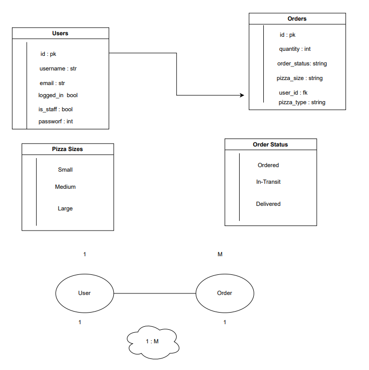

# <ins> PIZZA DELIVERY - FASTAPI </ins>


## <ins> INSTRUCTIONS : </ins>

- ACTIVATE VIRTUTAL ENVIRONMENT
```
 source env/Scripts/activate
```

- INSTALL FASTAPI
```
pip3 install fastapi[all]
```

- INSTALL UVICORN
```
pip3 install uvicorn[standard]
```


## DATABASE SCHEMA AND RELATIONSHIPS :




